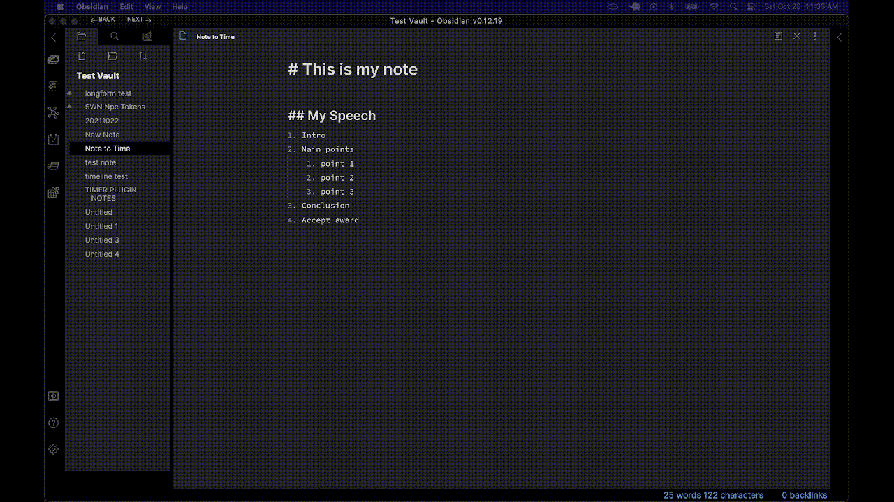
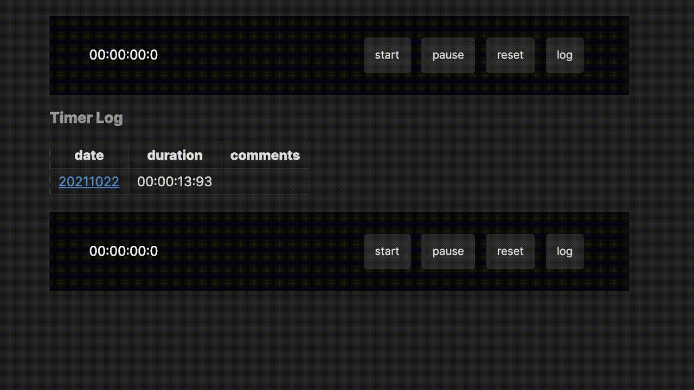

# Obsidian Note Timer
This plugin for [Obsidian](https://obsidian.md/) uses codeblocks to insert an interactive timer to your notes. 

## Features
Time individual notes and automatically keep an editable log of your times!



## Usage
Add a code block timer to any note with the following:
````markdown
```timer

```
````
You can adjust the features of all timers in the settings tab, but you can also fine tune individual timers :
````markdown
```timer
log: true
ms: true
```
````
> NOTE: Timer specific settings always take precedence over globally set settings.

Here are the available settings and their values
| Setting | Values | Description |
| ------- | ------ | ----------- |
| `log`   | `true` or `false` | If `true`, adds the log button to the timer controls. Clicking this adds a new entry to your note's timer log markdown table.<br>If `false`, removes the log button, and disallows logging for this timer.
| `ms` | `true` or `false` | If `true`, timer displays as HH:MM:SS:sss.<br>If `false`, timer displays without the fast updating millesconds.<br>*note:* this option only changes the display, not the speed at which the timer runs.

> NOTE: As development continues, more features that are available in global settings will be added to timer specific settings


## Installation
- Download the Latest Release from the Releases section.
- Extract the plugin folder from the zip to your vault's plugins folder: `<vault>/.obsidian/plugins/`
- Reload Obsidian
- If prompted about Safe Mode, you can disable safe mode and enable the plugin. Otherwise head to Settings, third-party plugins, make sure safe mode is off and enable the plugin from there.

## For Developers
This is my first plugin for Obsidian, and it has definitely been built with huge support from the community. Pull requeste are welcomed and appreciated!

Feel free to let me know of any issues or concerns with this plugin or if you have a solution to any of the below:
### Known Issues/Accidental Features
1. Multiple timers in one note all log to the same table
    

> NOTE: bug 1 might be turned into a feature by allowing the user to declare `log-ID: Special` and then the function will search for the header `###### Special Timer Log`, but as of right now the current behavior is unexpected.

## Support
Hey! Thanks for checking out my Obsidian plugin!

If you like my work and want to support me going forward, please consider donating. 

[](https://ko-fi.com/S6S55K9XD)